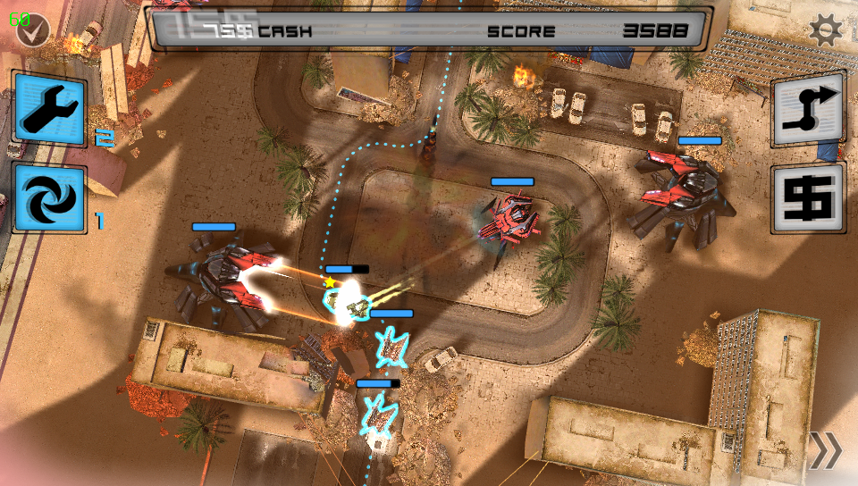

# Anomaly Warzone Earth HD Vita

<p align="center"></p>

This is a wrapper/port of <b>Anomaly: Warzone Earth HD</b> for the *PS Vita*.

The port works by loading the official Android ARMv6 executable in memory, resolving its imports with native functions and patching it in order to properly run.

## Note

This wrapper has been tested only with v.1.12 since it's the last version not featuring an OBB file.

## Changelog

### v.1.2

- Added configurable settings and related configurator app (Anti-Aliasing, Framecap).
- Bound Start to pause game.
- Bound L Trigger to mission goals showup.
- Bound R Trigger to fast forward.
- Reworked Livearea assets (Thanks to Once13one).

### v.1.1

- Moved to precompiled shaders usage. Makes loading times much faster.
- Made so that it's possible to pause/resume game by pressing the Start button.
- Disabled game logs. Slightly improves performances.

### v1.0

- Initial release.

## Setup Instructions (For End Users)

In order to properly install the game, you'll have to follow these steps precisely:

- Install [kubridge](https://github.com/TheOfficialFloW/kubridge/releases/) and [FdFix](https://github.com/TheOfficialFloW/FdFix/releases/) by copying `kubridge.skprx` and `fd_fix.skprx` to your taiHEN plugins folder (usually `ux0:tai`) and adding two entries to your `config.txt` under `*KERNEL`:
  
```
  *KERNEL
  ux0:tai/kubridge.skprx
  ux0:tai/fd_fix.skprx
```

**Note** Don't install fd_fix.skprx if you're using rePatch plugin

- **Optional**: Install [PSVshell](https://github.com/Electry/PSVshell/releases) to overclock your device to 500Mhz.
- Install `libshacccg.suprx`, if you don't have it already, by following [this guide](https://samilops2.gitbook.io/vita-troubleshooting-guide/shader-compiler/extract-libshacccg.suprx).
- Obtain your copy of *Anomaly: Warzone Earth HD* legally for Android in form of an `.apk` file.
- Open the apk with your zip explorer and extract the file `libAndroidGame.so` from the `lib/armeabi` folder to `ux0:data/anomaly`. 
- Extract the folder `assets` to `ux0:data/anomaly`.

## Build Instructions (For Developers)

In order to build the loader, you'll need a [vitasdk](https://github.com/vitasdk) build fully compiled with softfp usage.  
You can find a precompiled version here: https://github.com/vitasdk/buildscripts/actions/runs/1102643776.  
Additionally, you'll need these libraries to be compiled as well with `-mfloat-abi=softfp` added to their CFLAGS:

- [openal-soft](https://github.com/isage/openal-soft/tree/vita-1.19.1)

  - ```bash
    cd build
    cmake -DCMAKE_TOOLCHAIN_FILE=${VITASDK}/share/vita.toolchain.cmake -DCMAKE_BUILD_TYPE=Release -DCMAKE_C_FLAGS=-mfloat-abi=softfp .. && make install
    ```

- [libmathneon](https://github.com/Rinnegatamante/math-neon)

  - ```bash
    make install
    ```

- [vitaShaRK](https://github.com/Rinnegatamante/vitaShaRK)

  - ```bash
    make install
    ```

- [kubridge](https://github.com/TheOfficialFloW/kubridge)

  - ```bash
    mkdir build && cd build
    cmake .. && make install
    ```

- [vitaGL](https://github.com/Rinnegatamante/vitaGL)

  - ````bash
    make SOFTFP_ABI=1 PHYCONT_ON_DEMAND=1 NO_DEBUG=1 install
    ````

After all these requirements are met, you can compile the loader with the following commands:

```bash
mkdir build && cd build
cmake .. && make
```

## Credits

- CatoTheYounger for the screenshots and for testing the homebrew.
- gl33ntwine for helping dealing with partial automatization of shaders translation.
- Once13one for the Livearea assets.
